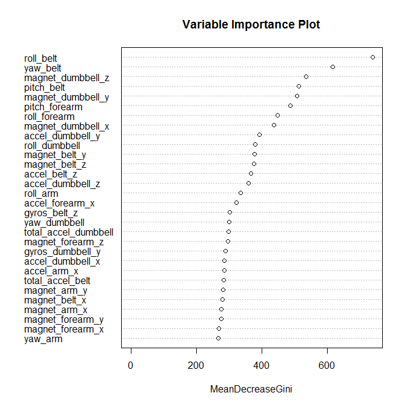

# Machine Learning Project

## Introduction
The purpose of this exercise is to apply machine learning algorithms to a prediction problem in Human Activity Recognition (HAR). Our data comes from the Weight Lifting Exercises (WLE) Dataset from the paper Qualitative Activity Recognition of Weight Lifting Exercises by Velloso, Bulling, Gellersen, Ugulino & Fuks. The aim is to predict the manner in which an exercise (Unilateral Dumbbell Bicep Curl) was being carried out by looking at data collected from a set of wearable sensors (Qualitative Activity Recognition). The sensors (mounted to 4 spots: belt, arm, forearm & dumbbell) records accelaration, gyroscope and magnetometer readings in 3 dimension. 

It should be noted for this exercise unlike the original paper, we did not split the data into windows and use summary statistics as predictors. Instead, our models were trained on the raw readings therefore might be subjected to higher degree of overfitting. 

We applied machine learning algorithms on 52 continuous predictors to predict which class (A,B,C,D or E) our response falls into. Classification Tree (CART) and Linear Discriminant Analysis (LDA) were first used. However, they did not performed well on the test set: CART's accuracy is 49% while LDA's is 70%. We then proceed on to ensemble models. We applied Random Forest and found it highly accurate in predicting the response class thus selected it as our final model. 10-fold cross validation was used to estimate the out-of-sample error rate (~0.5%). The chosen model was applied to twenty test cases and is able to predict the correct class for all twenty cases.
  
## Analysis
### Preparing required packages

```r
library(caret)
library(randomForest)
set.seed(628)
```

### Loading training data and test cases

```r
rawTraining <- read.csv("pml-training.csv")
rawTestCases <- read.csv("pml-testing.csv")
unused_col <- which(is.na(rawTestCases[1,]))
names(rawTraining)[-unused_col]
```

```
##  [1] "X"                    "user_name"            "raw_timestamp_part_1"
##  [4] "raw_timestamp_part_2" "cvtd_timestamp"       "new_window"          
##  [7] "num_window"           "roll_belt"            "pitch_belt"          
## [10] "yaw_belt"             "total_accel_belt"     "gyros_belt_x"        
## [13] "gyros_belt_y"         "gyros_belt_z"         "accel_belt_x"        
## [16] "accel_belt_y"         "accel_belt_z"         "magnet_belt_x"       
## [19] "magnet_belt_y"        "magnet_belt_z"        "roll_arm"            
## [22] "pitch_arm"            "yaw_arm"              "total_accel_arm"     
## [25] "gyros_arm_x"          "gyros_arm_y"          "gyros_arm_z"         
## [28] "accel_arm_x"          "accel_arm_y"          "accel_arm_z"         
## [31] "magnet_arm_x"         "magnet_arm_y"         "magnet_arm_z"        
## [34] "roll_dumbbell"        "pitch_dumbbell"       "yaw_dumbbell"        
## [37] "total_accel_dumbbell" "gyros_dumbbell_x"     "gyros_dumbbell_y"    
## [40] "gyros_dumbbell_z"     "accel_dumbbell_x"     "accel_dumbbell_y"    
## [43] "accel_dumbbell_z"     "magnet_dumbbell_x"    "magnet_dumbbell_y"   
## [46] "magnet_dumbbell_z"    "roll_forearm"         "pitch_forearm"       
## [49] "yaw_forearm"          "total_accel_forearm"  "gyros_forearm_x"     
## [52] "gyros_forearm_y"      "gyros_forearm_z"      "accel_forearm_x"     
## [55] "accel_forearm_y"      "accel_forearm_z"      "magnet_forearm_x"    
## [58] "magnet_forearm_y"     "magnet_forearm_z"     "classe"
```
The first 7 columns does not contain useful information for prediction. Therefore they are excluded.

### Data splitting

```r
unused_col <- c(1:7,unused_col)
inTrain <- createDataPartition(rawTraining$classe,p=0.7,list=FALSE)
training <- rawTraining[inTrain,-unused_col]
testing <- rawTraining[-inTrain,-unused_col]
```
We splited the training data into 70% training set and 30% test sets.

### Model selection and training

```r
model1 <- train(classe~.,data=training,method="rpart")
pred1 <- predict(model1,testing)
confusionMatrix(pred1,testing$classe)
```

```
## Confusion Matrix and Statistics
## 
##           Reference
## Prediction    A    B    C    D    E
##          A 1502  463  465  403  151
##          B   32  387   34  180  160
##          C  135  289  527  381  297
##          D    0    0    0    0    0
##          E    5    0    0    0  474
## 
## Overall Statistics
##                                         
##                Accuracy : 0.491         
##                  95% CI : (0.478, 0.504)
##     No Information Rate : 0.284         
##     P-Value [Acc > NIR] : <2e-16        
##                                         
##                   Kappa : 0.336         
##  Mcnemar's Test P-Value : NA            
## 
## Statistics by Class:
## 
##                      Class: A Class: B Class: C Class: D Class: E
## Sensitivity             0.897   0.3398   0.5136    0.000   0.4381
## Specificity             0.648   0.9145   0.7732    1.000   0.9990
## Pos Pred Value          0.503   0.4880   0.3235      NaN   0.9896
## Neg Pred Value          0.941   0.8523   0.8828    0.836   0.8875
## Prevalence              0.284   0.1935   0.1743    0.164   0.1839
## Detection Rate          0.255   0.0658   0.0895    0.000   0.0805
## Detection Prevalence    0.507   0.1347   0.2768    0.000   0.0814
## Balanced Accuracy       0.773   0.6271   0.6434    0.500   0.7185
```

```r
model2 <- train(classe~.,data=training,method="lda")
pred2 <- predict(model2,testing)
confusionMatrix(pred2,testing$classe)
```

```
## Confusion Matrix and Statistics
## 
##           Reference
## Prediction    A    B    C    D    E
##          A 1367  179  108   58   42
##          B   28  713  114   33  167
##          C  137  138  659  107   95
##          D  128   39  118  729  120
##          E   14   70   27   37  658
## 
## Overall Statistics
##                                         
##                Accuracy : 0.701         
##                  95% CI : (0.689, 0.713)
##     No Information Rate : 0.284         
##     P-Value [Acc > NIR] : <2e-16        
##                                         
##                   Kappa : 0.622         
##  Mcnemar's Test P-Value : <2e-16        
## 
## Statistics by Class:
## 
##                      Class: A Class: B Class: C Class: D Class: E
## Sensitivity             0.817    0.626    0.642    0.756    0.608
## Specificity             0.908    0.928    0.902    0.918    0.969
## Pos Pred Value          0.779    0.676    0.580    0.643    0.816
## Neg Pred Value          0.926    0.912    0.923    0.951    0.917
## Prevalence              0.284    0.194    0.174    0.164    0.184
## Detection Rate          0.232    0.121    0.112    0.124    0.112
## Detection Prevalence    0.298    0.179    0.193    0.193    0.137
## Balanced Accuracy       0.862    0.777    0.772    0.837    0.789
```
As can be seen, accuracy for the CART and LDA models are relatively low. For all the classes, sensitivity hardly exceeds 80%. Same for positive predictive value.

### Using ensemble models
We see if ensemble models can give us better result. Random Forest was used:

```r
model3 <- train(classe~.,data=training,method="rf",trControl=trainControl(method="oob"))
pred3 <- predict(model3,testing)
confusionMatrix(pred3,testing$classe)
```

```
## Confusion Matrix and Statistics
## 
##           Reference
## Prediction    A    B    C    D    E
##          A 1671    9    0    0    0
##          B    3 1127   11    0    0
##          C    0    3 1015   19    0
##          D    0    0    0  945    2
##          E    0    0    0    0 1080
## 
## Overall Statistics
##                                         
##                Accuracy : 0.992         
##                  95% CI : (0.989, 0.994)
##     No Information Rate : 0.284         
##     P-Value [Acc > NIR] : <2e-16        
##                                         
##                   Kappa : 0.99          
##  Mcnemar's Test P-Value : NA            
## 
## Statistics by Class:
## 
##                      Class: A Class: B Class: C Class: D Class: E
## Sensitivity             0.998    0.989    0.989    0.980    0.998
## Specificity             0.998    0.997    0.995    1.000    1.000
## Pos Pred Value          0.995    0.988    0.979    0.998    1.000
## Neg Pred Value          0.999    0.997    0.998    0.996    1.000
## Prevalence              0.284    0.194    0.174    0.164    0.184
## Detection Rate          0.284    0.192    0.172    0.161    0.184
## Detection Prevalence    0.285    0.194    0.176    0.161    0.184
## Balanced Accuracy       0.998    0.993    0.992    0.990    0.999
```
Results from Random Forest were optimistic with accuracy close to 99% and sensitivity and positive predictive value exceeding 99% for all classes. Random Forest is chosen as our final model.
  
## Estimating Out-of-Sample error rate with cross validation

```r
model3$bestTune
```

```
##   mtry
## 1    2
```

```r
folds <- createFolds(rawTraining$classe,k=10)
compare_perf <- matrix(,nrow=0,ncol=7)
topTenImpVar <- matrix(,nrow=10,ncol=0)
for(k in 1:10){
    modelk <- randomForest(classe~.,data=rawTraining[-folds[[k]],-unused_col],mtry=2)
    predk <- predict(modelk,rawTraining[folds[[k]],-unused_col])
    cfM <- confusionMatrix(predk,rawTraining[folds[[k]],"classe"])
    compare_perf <- rbind(compare_perf,cfM$overall)
    vI <- varImp(modelk)
    topTenImpVar <- cbind(topTenImpVar,rownames(vI)[order(vI,decreasing=TRUE)][1:10])
}
compare_perf[,1:4]
```

```
##       Accuracy  Kappa AccuracyLower AccuracyUpper
##  [1,]   0.9918 0.9897        0.9868        0.9953
##  [2,]   0.9939 0.9923        0.9893        0.9968
##  [3,]   0.9964 0.9955        0.9927        0.9986
##  [4,]   0.9954 0.9942        0.9913        0.9979
##  [5,]   0.9975 0.9968        0.9941        0.9992
##  [6,]   0.9959 0.9948        0.9920        0.9982
##  [7,]   0.9959 0.9948        0.9920        0.9982
##  [8,]   0.9954 0.9942        0.9913        0.9979
##  [9,]   0.9959 0.9948        0.9920        0.9982
## [10,]   0.9944 0.9929        0.9900        0.9972
```

```r
colMeans(compare_perf)[1:4]
```

```
##      Accuracy         Kappa AccuracyLower AccuracyUpper 
##        0.9953        0.9940        0.9911        0.9978
```
Using 10-fold cross validation, we estimate out-of-sample error rate to be around 0.5%.
  
## Applying the final model in prediction

```r
finalModel <- randomForest(classe~.,rawTraining[,-unused_col],mtry=2)
```

```r
varImpPlot(finalModel, main="Variable Importance Plot")
```

 

The variable importance plot shows the most important variables for identifying the response's class is (1) Roll of belt sensor, (2) Yaw of belt sensor and (3) Magnetometer reading in the z direction. We compare this to the trained predictors from our 10-fold cross validation.


```r
topTenImpVar
```

```
##       [,1]                [,2]                [,3]               
##  [1,] "roll_belt"         "roll_belt"         "roll_belt"        
##  [2,] "yaw_belt"          "yaw_belt"          "yaw_belt"         
##  [3,] "magnet_dumbbell_z" "magnet_dumbbell_z" "magnet_dumbbell_z"
##  [4,] "magnet_dumbbell_y" "magnet_dumbbell_y" "pitch_belt"       
##  [5,] "pitch_belt"        "pitch_belt"        "magnet_dumbbell_y"
##  [6,] "pitch_forearm"     "pitch_forearm"     "pitch_forearm"    
##  [7,] "roll_forearm"      "roll_forearm"      "magnet_dumbbell_x"
##  [8,] "magnet_dumbbell_x" "magnet_dumbbell_x" "roll_forearm"     
##  [9,] "accel_belt_z"      "accel_belt_z"      "accel_belt_z"     
## [10,] "magnet_belt_y"     "magnet_belt_z"     "accel_dumbbell_y" 
##       [,4]                [,5]                [,6]               
##  [1,] "roll_belt"         "roll_belt"         "roll_belt"        
##  [2,] "yaw_belt"          "yaw_belt"          "yaw_belt"         
##  [3,] "magnet_dumbbell_z" "magnet_dumbbell_z" "magnet_dumbbell_z"
##  [4,] "pitch_forearm"     "magnet_dumbbell_y" "magnet_dumbbell_y"
##  [5,] "magnet_dumbbell_y" "pitch_belt"        "pitch_belt"       
##  [6,] "pitch_belt"        "pitch_forearm"     "pitch_forearm"    
##  [7,] "magnet_dumbbell_x" "magnet_dumbbell_x" "magnet_dumbbell_x"
##  [8,] "roll_forearm"      "roll_forearm"      "roll_forearm"     
##  [9,] "accel_belt_z"      "accel_dumbbell_y"  "accel_dumbbell_y" 
## [10,] "magnet_belt_z"     "magnet_belt_y"     "accel_belt_z"     
##       [,7]                [,8]                [,9]               
##  [1,] "roll_belt"         "roll_belt"         "roll_belt"        
##  [2,] "yaw_belt"          "yaw_belt"          "yaw_belt"         
##  [3,] "magnet_dumbbell_z" "magnet_dumbbell_z" "magnet_dumbbell_z"
##  [4,] "pitch_belt"        "pitch_belt"        "magnet_dumbbell_y"
##  [5,] "magnet_dumbbell_y" "pitch_forearm"     "pitch_belt"       
##  [6,] "pitch_forearm"     "magnet_dumbbell_y" "pitch_forearm"    
##  [7,] "magnet_dumbbell_x" "roll_forearm"      "magnet_dumbbell_x"
##  [8,] "roll_forearm"      "magnet_dumbbell_x" "roll_forearm"     
##  [9,] "accel_dumbbell_y"  "accel_belt_z"      "magnet_belt_z"    
## [10,] "magnet_belt_z"     "magnet_belt_z"     "accel_dumbbell_y" 
##       [,10]              
##  [1,] "roll_belt"        
##  [2,] "yaw_belt"         
##  [3,] "magnet_dumbbell_z"
##  [4,] "magnet_dumbbell_y"
##  [5,] "pitch_forearm"    
##  [6,] "pitch_belt"       
##  [7,] "magnet_dumbbell_x"
##  [8,] "roll_forearm"     
##  [9,] "accel_belt_z"     
## [10,] "accel_dumbbell_y"
```
We can see the top 10 ranking are fairly consistent and also agree with the list for the final model which was applied on the entire training data. This shows the final chosen model is reliable across different sets of training data thus give us further confidence in our result.
  
We applied our chosen model to the test cases and obtained the following results:

```r
answer <- predict(finalModel,rawTestCases); answer
```

```
##  1  2  3  4  5  6  7  8  9 10 11 12 13 14 15 16 17 18 19 20 
##  B  A  B  A  A  E  D  B  A  A  B  C  B  A  E  E  A  B  B  B 
## Levels: A B C D E
```
  
## Reference
Velloso, E.; Bulling, A.; Gellersen, H.; Ugulino, W.; Fuks, H. Qualitative Activity Recognition of Weight Lifting Exercises. Proceedings of 4th International Conference in Cooperation with SIGCHI (Augmented Human '13) . Stuttgart, Germany: ACM SIGCHI, 2013.
  
# End
